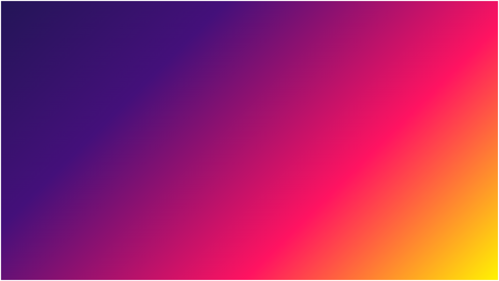
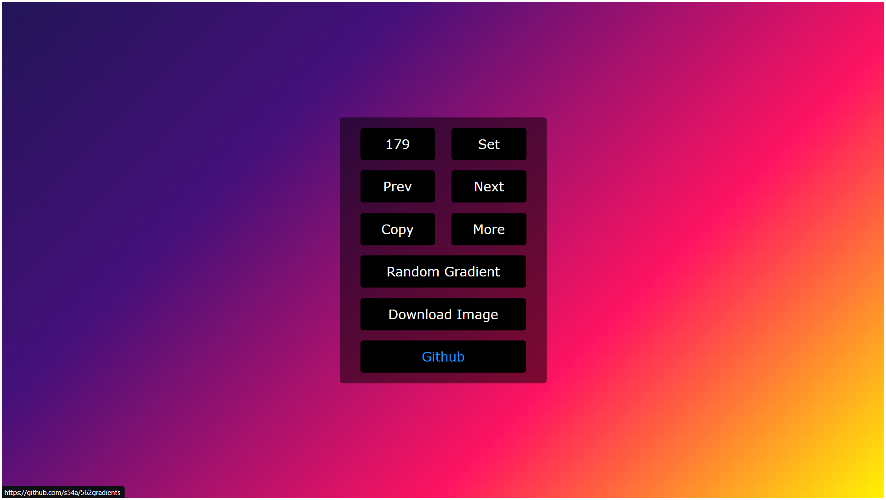
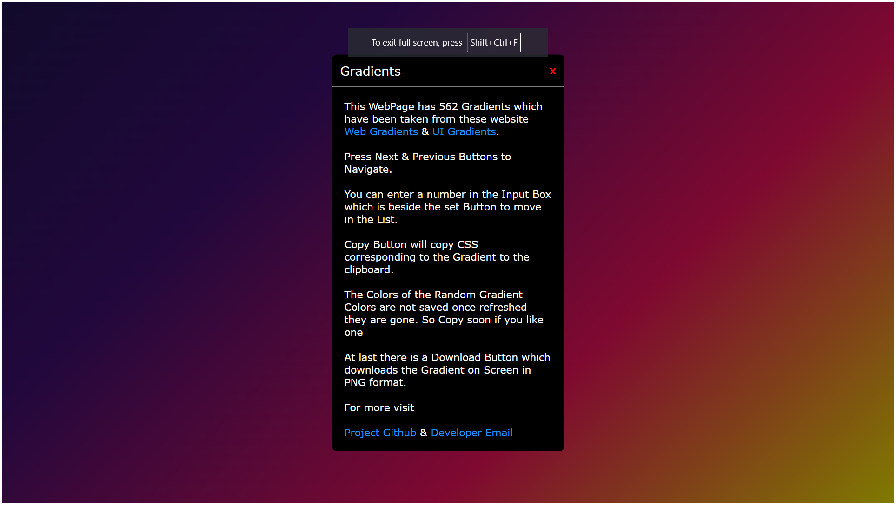

# Gradient Generator

## Introduction

The Gradient Generator project was conceived during the early stages of my web development journey to address the challenge of finding suitable gradients for web applications. While exploring existing resources such as [Web Gradients](https://webgradients.com) and [ui Gradients](https://uigradients.com), I realized the abundance of gradients available. However, driven by a desire to build a solution independently, I embarked on creating my own Gradient Generator.

## Project Overview

The Gradient Generator offers users access to a curated list of gradients sourced from prominent open-source projects like [Web Gradients](https://webgradients.com) and [ui Gradients](https://uigradients.com). Key features include:

- CSS copying functionality for easy integration into web projects.
- Random gradient generation using JavaScript's Math.Random() function.
- PNG download capability for generated gradients.

## Technologies Used

- HTML, CSS, JavaScript
- Vite (Build Tool)
- [Toastify-JS](Https://github.com/apvarun/toastify-js) for notifications
- [HTML2Canvas](https://github.com/niklasvh/html2canvas) for converting gradients to images and downloading them

## Cloning Instructions

To clone and run the project locally:

```bash
git clone https://github.com/s9-g/562gradients.git
cd 562gradients
npm install
npm run dev
```

## How It Works

Upon page load, users are presented with a gradient background. Hovering over the middle section reveals controls, including an input box to navigate the gradient list and buttons for copying CSS, generating random gradients, and downloading gradients as PNG images.

## Preview







## Deployed Link

The project is deployed and accessible online. You can visit it by following this link:

[562Gradients](https://562gradients.netlify.app/)

## Experiment I did with the Project

An experimental feature was implemented in the project, involving the inclusion of the favicon as base64 in the HTML. Additionally, [vite-plugin-singlefile](https://www.npmjs.com/package/vite-plugin-singlefile) was utilized to consolidate the compiled CSS and JavaScript into the HTML file, reducing HTTP requests. However, this approach may lead to additional file inclusion by hosting platforms like Netlify and affect the website's detection by tools like Wappalyzer. The resulting size of Index.html is approximately 293 Kilobytes.

---
