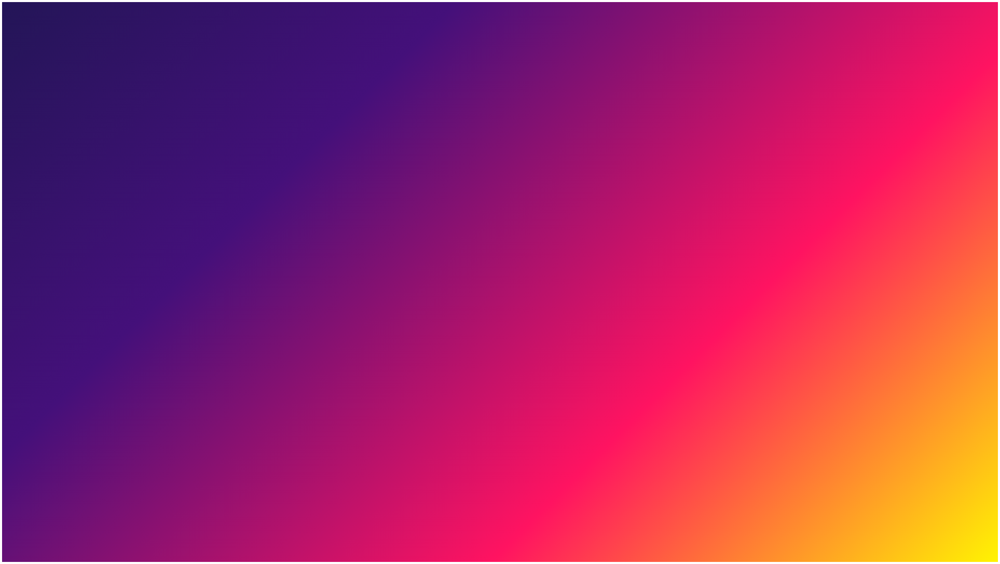
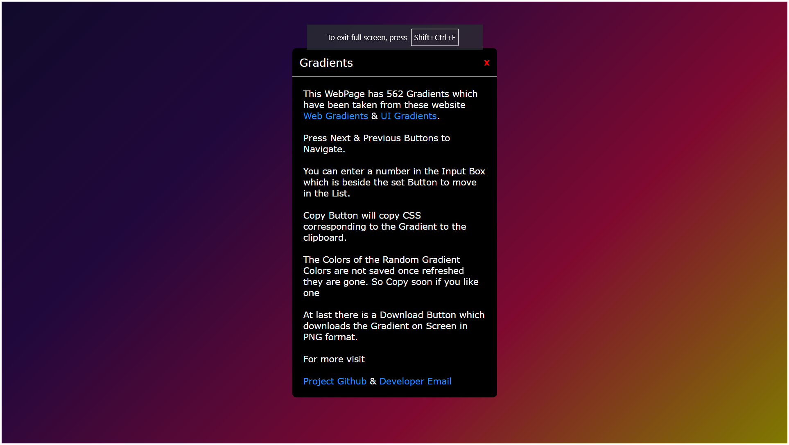

# Gradients

## Introduction

I Started This Project When I Had Just Started Learning Web Development trying to solve my problem of finding a Gradient

But Soon I Found a [Web Gradients](https://webgradients.com) & [ui Gradients](https://uigradients.com).

They had all the Gradients which I needed.

But I still wanted to build a Gradient Generator my self.

Since all the Gradients used in the Websites above were available, on Github. I used them and build this project on top of that.

## Project Overview

The Gradient Generator allows users to access a curated list of gradients sourced from open-source projects like [Web Gradients](https://webgradients.com) and [ui Gradients](https://uigradients.com).

- You can copy the CSS of the Gradients
- Generate Random
  - It uses JS Math.Random() to generate random Hex Codes which are then used to generate Gradients
- You can Download the Gradients as an PNG

## Technologies Used

- HTML, CSS, JavaScript
- Vite
- [Toastify-JS](Https://github.com/apvarun/toastify-js)
  - For Notifications
- [HTML2Canvas](https://github.com/niklasvh/html2canvas)
  - For Converting the Linear Gradient to an Image & Downloading it

## Cloning Instructions

To clone the project and run it locally:

```bash
git clone https://github.com/s9-g/562gradients.git

cd 562gradients

npm install

npm run dev
```

## How It Works

When the Page Loads There Are No Controls There is Only Just Background Set as a Gradient.

When You Hover in the Middle the Contorl Will Appear

The First Box Beside the "Set" Box is an Input Box Which Shows the Current Index of the Gradient From the List of 562 Gradients
You Can Input a Number From 1 to 562 to Go Up and Down in the List Quickly

The First 180 Gradients Are From Web Gradients Website and the Rest Are From Ui Gradients

Below Are Next & Prev Button

Below That There Are Copy and More Button

Copy Button Copies the CSS of the corresponding Gradient whether it is a Random Gradient or from the List to the User's Clipboard.

The User is Notified With Notification Using [Toastify-JS](Https://github.com/apvarun/toastify-js)

Then There is a Random Gradient Generator Button

At last ther is Button to Download the Gradient as a PNG

- Which uses [HTML2Canvas](https://github.com/niklasvh/html2canvas) Package

That's All There is

# Preview






## Experiment

I also did an experiment with the project

I inlcuded the favicon as base64 in the HTML

By using [vite-plugin-singlefile](https://www.npmjs.com/package/vite-plugin-singlefile) I pasted the compiled CSS & JS in the HTML File so know when you load the Website and while Network Tab is open in Developer Tools it will just make only 1 HTTP Request.

But Netilfiy maybe could add a file or two & if you something like Wappalyzer it also increases the 2 or 3 HTTP Requests

The size of Index.html is around 293 Kilobytes.

---
